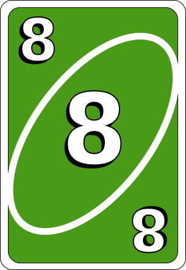

<div align="center">
    
    <p>Pit it out against your friends in this game based on the classic card game UNO.</p>
    <p>Play now at: <a href="https://ena-three.vercel.app/">https://ena-three.vercel.app/</a></p>
</div>

---

# Ena

**Ena** is a fast-paced, multiplayer online card game inspired by the classic game UNO. Challenge your friends or play with new people in real-time, with a modern, vibrant interface and smooth gameplay.

## Features

- **Multiplayer Online**: Play with 2-5 players in private or public rooms.
- **Real-Time Gameplay**: Instant updates and smooth transitions powered by Firebase.
- **Guest & Registered Play**: Jump in as a guest or sign up for a personalized experience.
- **Animated UI**: Enjoy a lively, cartoon-inspired interface with custom avatars and engaging effects.
- **Responsive Design**: Play seamlessly on desktop, tablet, or mobile.

## Screenshots

<p align="center">
  
  <p style="display:flex;flex-wrap:wrap;max-width:100%;width:100%;">
    
    
    
    
    
    
    
    
    
    
    
    
    
    
    
    
    
    
    
    
    
    
    
    
    
    
    
    
    
    
    
    
    
    
    
    
    
    
    
    
    
    
    
    
    
    
    
    
    
    
    
    
    
    
    
  </p>
</p>

## Technologies Used

- **Next.js**: Modern React framework for fast, server-rendered pages.
- **Firebase**: Real-time database, authentication, and storage.
- **Tailwind CSS**: Utility-first CSS for rapid, responsive design.
- **Material UI**: Accessible, customizable React UI components.
- **Lodash**: Utility library for data manipulation.
- **Vercel**: Deployment and hosting.

## Getting Started

1. **Clone the repository:**

   ```sh
   git clone https://github.com/yourusername/ena.git
   cd ena
   ```

2. **Install dependencies:**

   ```sh
   npm install
   ```

3. **Set up environment variables:**

   - Copy `.env.example` to `.env` and fill in your Firebase credentials.

4. **Run the development server:**

   ```sh
   npm run dev
   ```

5. **Open your browser:**
   - Visit [http://localhost:3000](http://localhost:3000) to start playing.

## Contributing

Contributions are welcome! Please open an issue or submit a pull request.

## License

This project is licensed under the MIT License.

---

<p align="center">
  <b>Enjoy playing Ena with your friends!</b>
</p>
